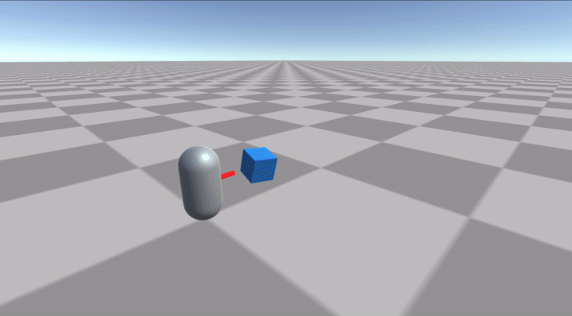
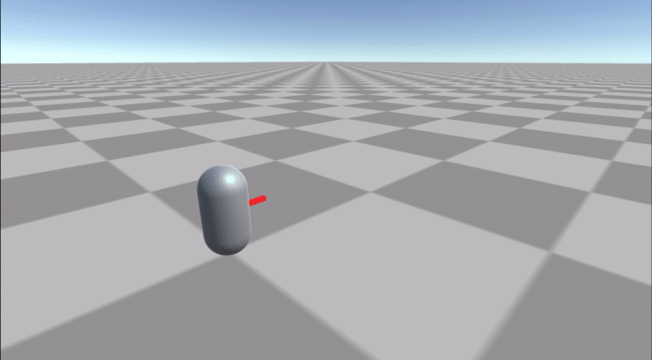
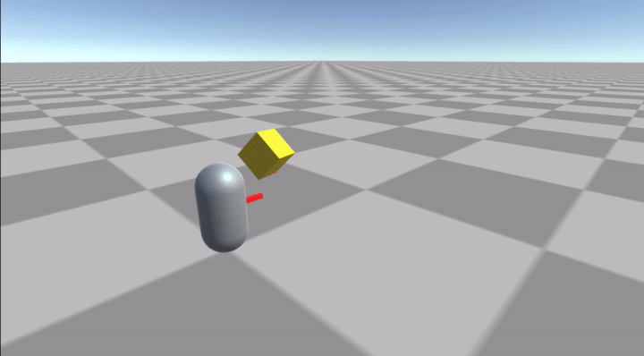

# simple-bullet-cast
Unity の ObjectPool を使った弾を撃つサンプルです。

## 開発環境

macOS Big Sur 11.5

Unity 2021.1.12f1

## 操作

### キーボード

|内容|割り当てキー|
| ---- | ---- |
|前へ向く|W|
|後ろへ向く|S|
|右へ向く|D|
|左へ向く|A|
|弾を撃つ(Line)|control|
|弾を撃つ(Parabolic)|option(alt)|
|弾を撃つ(Curve)|shift|

### ゲームコントローラー(PS4)
|内容|割り当てボタン|
| ---- | ---- |
|前へ向く|左スティック(前に倒す)|
|後ろへ向く|左スティック(後ろに倒す)|
|右へ向く|左スティック(右に倒す)|
|左へ向く|左スティック(左に倒す)|
|弾を撃つ(Line)|□|
|弾を撃つ(Parabolic)|✕|
|弾を撃つ(Curve)|○|

## 実行画面

直進する弾

放物線を描く弾

パスに沿って移動する弾

## 解説

- [弾を撃つ – ObjectPool を使いこなす](https://heratta-lab.com/simple-bullet-cast/)
